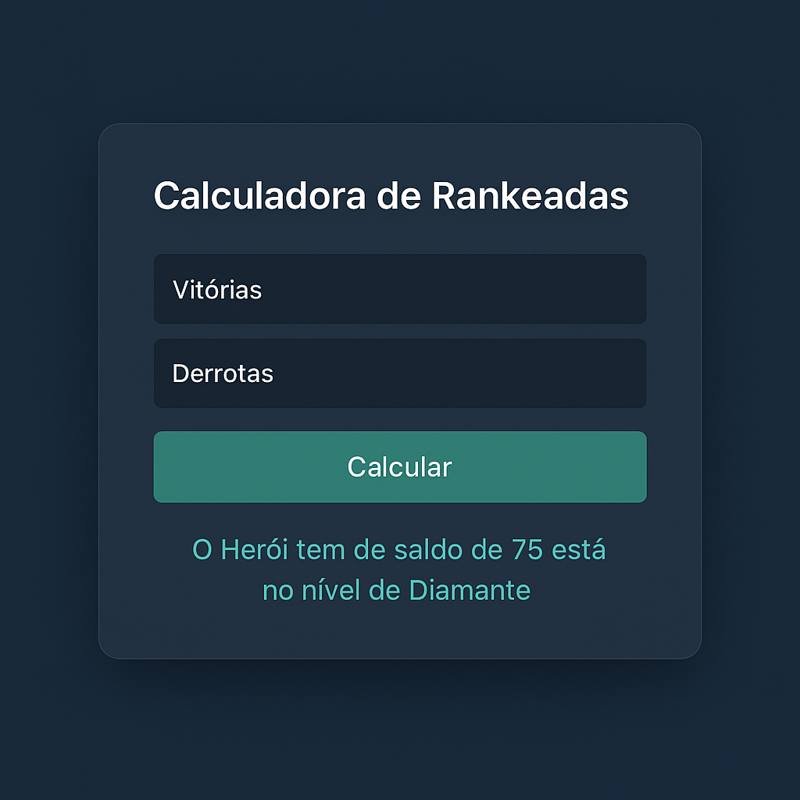

# 🧮 Calculadora de Partidas Rankeadas

Uma aplicação simples em **HTML**, **CSS** e **JavaScript** que calcula o saldo de vitórias e derrotas de um jogador e retorna o seu **nível ranqueado**, com base em regras definidas.

---

## 🖼️ Preview



---

## 📌 Funcionalidades

- Entrada de vitórias e derrotas
- Cálculo automático do saldo (vitórias - derrotas)
- Exibição do nível do jogador conforme a pontuação
- Interface responsiva e amigável

---

## 📊 Tabela de Níveis

| Vitórias         | Nível     |
|------------------|-----------|
| Menor que 10     | Ferro     |
| 11 a 20          | Bronze    |
| 21 a 50          | Prata     |
| 51 a 80          | Ouro      |
| 81 a 90          | Diamante  |
| 91 a 100         | Lendário  |
| 101 ou mais      | Imortal   |

---

## 🚀 Como usar

1. Clone o repositório ou baixe os arquivos:
   ```bash
   git clone https://github.com/seu-usuario/calculadora-rankeadas.git
   ```

2. Abra o arquivo `index.html` no seu navegador.

3. Insira o número de vitórias e derrotas.

4. Clique em **Calcular** para ver o resultado.

---

## 📁 Estrutura do Projeto

```
calculadora-rankeadas/
├── index.html
├── style.css
├── script.js
├── preview.png
└── README.md
```

---

## 💻 Tecnologias

- HTML5
- CSS3
- JavaScript (Vanilla)

---

## 📝 Licença

Este projeto está licenciado sob a **MIT License**. Sinta-se livre para usar, modificar e compartilhar!
